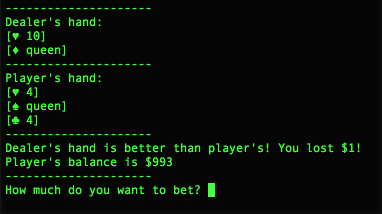

# Blackjack Game

A python blackjack game that can be played via console/terminal

#### How to run

Clone the remote repository:

`git clone https://github.com/tuliorc/blackjack.git`

Go into your new local repository:

`cd blackjack`

Make sure you have Python3 installed in your computer:

`python -V`

In case you don't, install it:

`sudo apt-get update`

`sudo apt-get install python3.6`

Execute the main script:

`python3 blackjack.py`

#### How to play
1) You will be asked about your initial balance and how much do you want to bet in the initial round.
2) Then, you will be dealt with two cards and also will be the dealer, but you will able to see only one of his cards.
3) Then, you will have to choose choose between hitting or standing. 
- You should hit until comfortable with your cards in hand. Please note that they cannot exceed 21 points or you will be busted!
- You should stand when your total points in hand are way too close to 21 points. When you choose to stand, dealer will draw cards for himself until he reaches 17 points. 
4) After player and dealer have finished putting cards in hand, the game will check whether if there was any busted hand or a possible tie. The hand that gets closer to 21 points without busting, wins! 
5) Steps 2-5 are repeated until player quits the game or his money balance reaches 0.

You can learn more about blackjack rules here: https://en.wikipedia.org/wiki/Blackjack.

Have fun! :) 
